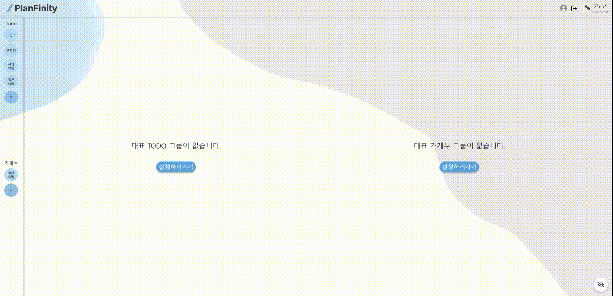

<h1>수리야</h1>

  

 
<h3 align="center">코드스테이츠 44기 메인프로젝트</h3>

- **팀 명 :**  수리야
- **프로젝트 명 :** PlanFinity
- **프로젝트 기간 :** 2023.06.28 - 2023.07.27
- **한줄 소개 :** 관리? 하나로 해결하자! (일정관리 + 가계부)를 하나로 관리할 수 있는 웹 서비스
- **팀원 :** 조성건(팀장), 안지수(부팀장), 김유진, 김진아, 유승연, 조승아, 장윤희
- **팀노션 링크 :** [💁🏻 노션 링크](https://www.notion.so/codestates/0a5cb1b9fde841898df9a3039c483ad8?pvs=4)
- **배포 링크 :** [📮 링크](https://codestates.shop/)

## 🛫 프로젝트 개요
`PlanFinity` 서비스는 직장인과 여행객을 대상으로 Todo 리스트와 가계부를 하나의 웹으로 관리 가능한 서비스를 개발하고자 하였습니다.  

현재까지는 이 두 기능이 각각 독립적으로 제공되는 경우가 많았지만, 저희 서비스는 하나의 플랫폼에서 Todo와 가계부를 함께 관리해 사용이 용이합니다.  

저희 서비스는 여러 개의 Todo 리스트와 가계부를 분리해서 관리할 수 있으며, 친구 초대 기능으로 여행 일정이나 일정들을 함께 관리할 수 있습니다. 
또한, 직장에서 사용할 경우 화면 보호기 기능을 통해 개인 정보를 보호할 수 있습니다.

## 👨‍👩‍👧‍👦 Team

### 💜 FE
| 안지수 (FE, 부팀장) | 김유진 (FE) | 장윤희 (FE) | 김진아 (FE) |
| :---: | :---: | :---: | :---: |
|  |  |  |  |
| [Scarlett0JS](https://github.com/Scarlett0JS) | [wwwwswe](https://github.com/wwwwswe) | [yuneejang](https://github.com/yuneejang) | [wlsdk7245](https://github.com/wlsdk7245) | 
|
- Login  - SignUp - Ledger Creat Modal
|
- Header, Sidebar, Layout - Ledger Calender - Error pages
|
- Home - Weather widget - Group settings modal
|
- Todo CRUD - Ledger List - Hide screen - My page
|

### 💚 BE
| 조성건 (BE, 팀장) | 조승아 (BE) | 유승연 (BE) |
| :---: | :---: | :---: |
|  |  |  |
| [Seonggeon2](https://github.com/Seonggeon2) |    [hiimsajo](https://github.com/hiimsajo) | [Seungyeon3](https://github.com/Seungyeon3) |
|
 - AWS(EC2, RDS) 배포환경 구축  - JWT 토큰을 이용한 인증
|
- Ledger 기능 담당  
|
- Todo 기능 담당 
|

## 📺 Demo
### Home 

### Todo 

### Ledger 

### My page 

### Hide screen 

### Error page 

## ➡️ User flow

 

## Tech Stack
### Tools
| Git | Github | Discord |
| :---: | :---: | :---: |
|  |  |  |
### Front-end
| JavaScript | React | Styled- Components | Zustand| React Query | esLint | Prettier |
| :---: | :---: | :---: | :---: | :---: | :---: | :---: |
|  | 

 | 

 |  | 

 | 

 | 

 |

### Back-end
| Java | mySQL | JWT | AWS | Spring | Spring Boot |
| :---: | :---: | :---: | :---: | :---: | :---: |
| 

 | 

 | 

 | 

 |  |  |
 

## 🌲 Git
### Branch
- `main` : 서비스 운영 브랜치입니다.
- `dev` : 개발 환경 브랜치입니다. 개별적으로 작업했던 내용을 합치고 검토합니다.
- `FE` : 프론트 공통 작업 브랜치입니다.
- `BE` : 백엔드 공통 작업 브랜치입니다.
- `feat/fe(or be)/...` : 프론트(백엔드) 세부 브랜치입니다.
### Commit & Pull-Request Message
| Division | Message |
| :---: | :--- |
| "feat: ~ " | 새로운 기능 추가 |
| "fix: ~ " | 버그 수정 |
| "design: ~ " | css와 같은 UI 수정 |
| "docs: ~ " | 문서 수정 (ex. README.md) |
| "remove: ~ " | 파일을 삭제만 한 경우 |